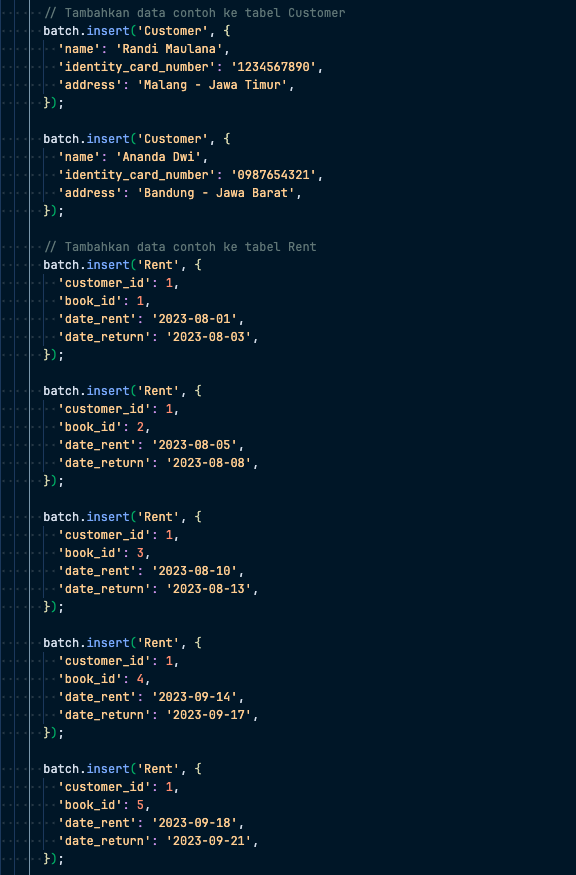
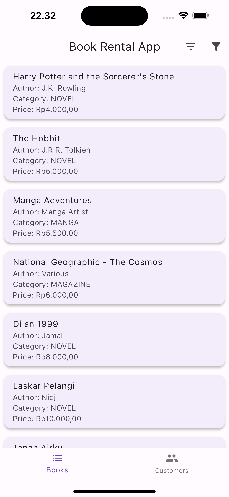
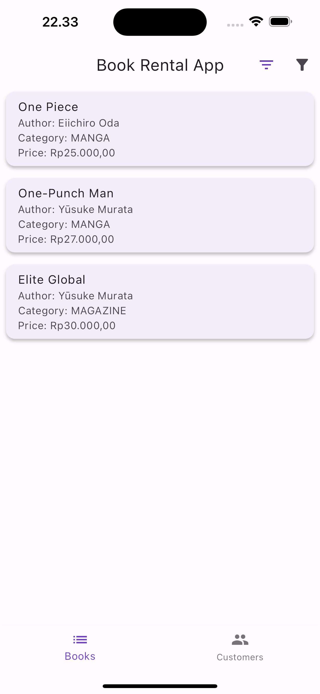

# 📋 Gestalt Systech - Technical Test

🚀 Ketentuan :

a. Menggunakan bahasa pemograman yang dikuasai, buatlah file terpisah masing-masing nomor
soal berisikan kode program dari soal-soal berikut ini.
b. Siapkan kode program tersebut sehingga saat dibuka / compile otomatis akan mengeluarkan
hasil keluaran yang diharapkan.
c. Pada setiap file berikan juga catatan berapa lama anda mengerjakan hal tersebut & bahasa
pemograman apa yang anda gunakan.
d. Silakan export hasil sql yang anda buat pada soal nomor 6 dan masukan kedalam pengumpulanfile
yang akan diberikan.

🤖 Notes:

Gunakanlah waktu sebaik mungkin, originalitas code menjadi salah satu point penilaian dengan
bobot tertinggi, lakukan juga Pattern Recognition untuk memecahkan setiap soal yang ada.

Waktu Pengiriman Source Code kembali kepada kami adalah Maximal 24 Jam dari email diterima.

Selamat Mengerjakan!

---

## 6. Terdapat kasus peminjaman buku dengan detail sebagai berikut:

Tabel : Buku
Column Data type Constraint
Id BIGINT Primary key
Title VARCHAR(100) NOT NULL
author VARCHAR(100)
Price_rent NUMERIC Price_rent > 0
Book_category VARCHAR(10) Input yang boleh diinputkan hanya : MANGA, NOVEL, MAGAZINE

Tabel : Customer
Column Data type Constraint
Id BIGINT Primary key
Name VARCHAR(100) NOT NULL
identity_card_number VARCHAR(50) NOT NULL
address VARCHAR(50)

Tabel: Rent
Column Data type Constraint
Id BIGINT Primary key
Customer_id BIGINT Foreign key from table Customer(id)
Book_id BIGINT Foreign key from table Book(id)
Date_Rent DATE NOT NULL
Date_Return DATE Date_Return > Date_Rent

a. Buatlah sebuah database dengan schema diatas
b. Isikan data contoh sesuai dengan table tersebut
c. Buatlah tampilan aplikasi berupa table untuk memunculkan data buku yang dirental
menggunakan Bahasa pemograman yang anda kuasai
d. Buatlah tombol filtrasi untuk memperlihatkan buku yang belum pernah dipinjam sama sekali
e. Buatlah tombol filtrasi untuk data tabel Buku yang harga peminjamannya lebih besar dari
Rp.2000 dan kurang dari Rp. 6000.
f. Buatlah tampilan untuk memperlihatkan data customer (nama_customer, judul buku, jumlah
buku yang dipinjam) yang telah meminjam buku lebih dari 10 kali

Jawaban:

### a :

### b :
 

### c :

### d :

### e :

### f :

---
